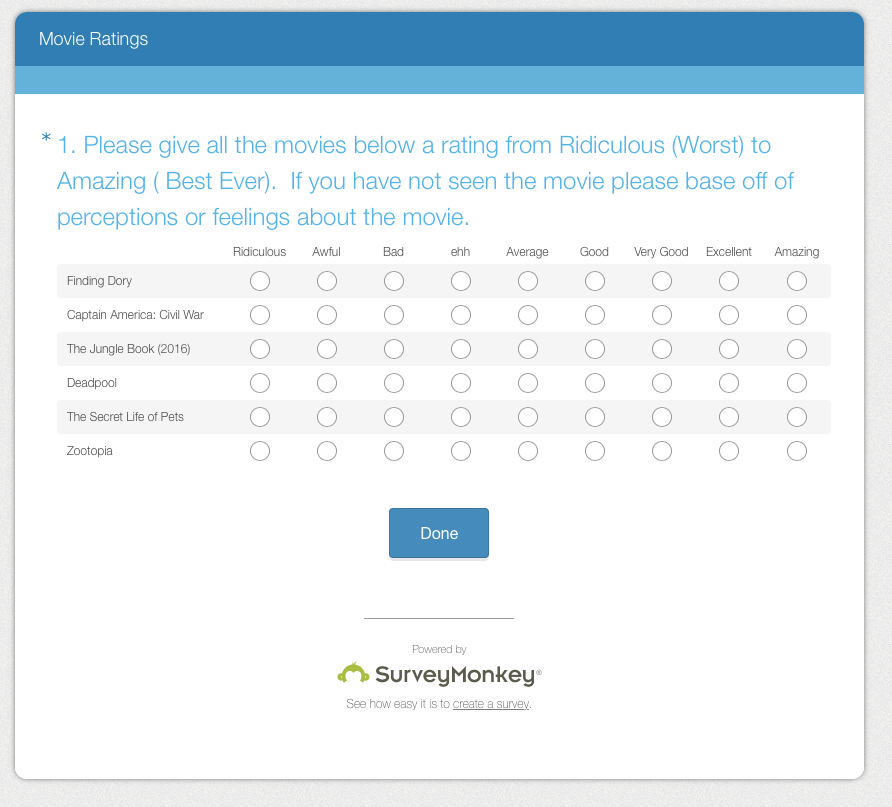

```{r, warning=FALSE, message = FALSE}

library("RMySQL")
library("DT")
library("knitr")
library("reshape2")
library("tidyr")
```

#Overview

##Assignment
Choose six recent popular movies.  Ask at least five people that you know (friends, family, classmates, imaginary friends) to rate each of these movie that they have seen on a scale of 1 to 5.  Take the results (observations) and store them in a mySQL database.  Load the information into an R dataframe.

##My take on the project

I used a Survey Monkey survey and distributed it to my friends to collect survery results.  



I extracted the Survey Monkey data into CSV file. I then loaded the CSV file into MySQL and viewed the data with R

#Get the data 

```{r warning=FALSE}

conn <- dbConnect(MySQL(), user='rnash', host='localhost', dbname='movies')

movieRatings <- dbGetQuery( conn, "select 
                                respondentid, movie, rating from movie_ratings" ) 
datatable ( movieRatings ) 

```

#Aggregate the data

```{r warning=FALSE, message=FALSE}


movieRatingsAgg <- dcast ( movieRatings, movie~rating )
movieRatingsAgg <- movieRatingsAgg[ , c("movie", "Ridiculous", "Awful", "Bad", "ehh", "Average", "Good", "Very Good", "Excellent", "Amazing")]
kable( movieRatingsAgg )
```

#Shape into a Likert type data frame

```{r}
movieRatingsLikert <- spread( movieRatings, movie, rating )
kable  ( movieRatingsLikert , ) 

```
